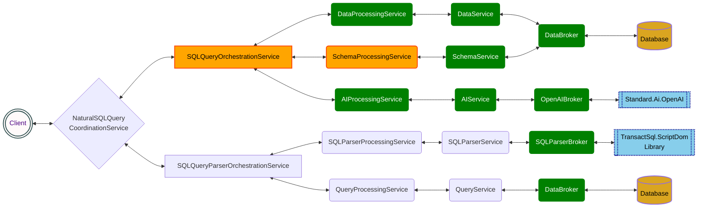

# Standard.AI.Data.EntityIntelligence

## Introduction
.NET library to convert natural language query into SQL queries and generate results

Standard.AI.Data.EntityIntelligence is a Standard-Compliant .NET library built on top of OpenAI endpoints to enable software engineers to develop AI-Powered solutions in .NET.

## Standard-Compliance
This library was built according to The Standard. The library follows engineering principles, patterns and tooling as recommended by The Standard.

This library is also a community effort which involved many nights of pair-programming, test-driven development and in-depth exploration research and design discussions.

## Standard-Promise
The most important fulfillment aspect in a Standard complaint system is aimed towards contributing to people, its evolution, and principles.
An organization that systematically honors an environment of learning, training, and sharing knowledge is an organization that learns from the past, makes calculated risks for the future, 
and brings everyone within it up to speed on the current state of things as honestly, rapidly, and efficiently as possible. 
 
We believe that everyone has the right to privacy, and will never do anything that could violate that right.
We are committed to writing ethical and responsible software, and will always strive to use our skills, coding, and systems for the good.
We believe that these beliefs will help to ensure that our software(s) are safe and secure and that it will never be used to harm or collect personal data for malicious purposes.
 
The Standard Community as a promise to you is in upholding these values.

## Current State of the Project

#

<!--

<a href="https://app.diagrams.net/#Hhassanhabib%2FStandard.AI.Data.EntityIntelligence%2Fmain%2Fstateoftheproject.drawio" target="_blank">Edit with Draw.io</a>-->

## How to use this library

### Nuget Package 
Project in development - 

## How to Contribute
If you want to contribute to this project please review the following documents:
- [The Standard](https://github.com/hassanhabib/The-Standard)
- [C# Coding Standard](https://github.com/hassanhabib/CSharpCodingStandard)
- [The Team Standard](https://github.com/hassanhabib/The-Standard-Team)

If you have a question make sure you either open an issue or join our [The Standard Community](https://discord.com/invite/vdPZ7hS52X) discord server.

## Live-Sessions
Our live-sessions are scheduled on [The Standard Calendar](https://tinyurl.com/the-standard-calendar) make sure you adjust the time to your city/timezone to be able to join us.

We broadcast on multiple platforms:

[YouTube](https://www.youtube.com/@HassanHabib)

[LinkedIn](https://www.linkedin.com/in/hassanrezkhabib/)

[Twitch](https://www.twitch.tv/binhabib)

[Twitter](https://twitter.com/HassanRezkHabib)

[Facebook](https://www.facebook.com/hassan.rezk.habib)

### Past-Sessions
Here's our live sessions to show you how this library was developed from scratch:

[Standard.EntityIntelligence YouTube Playlist](https://www.youtube.com/watch?v=wzT8tiIg70o&list=PLan3SCnsISTSf0q3FDvFLngnVpmiMte3L)

### Important Notice
This library is a community effort.
